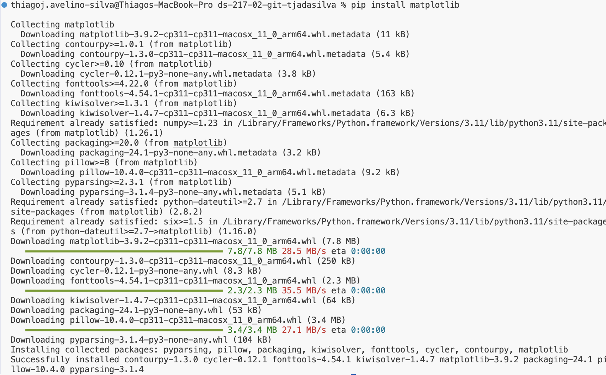

# Assignment 1

## i. GitHub Username:
**tjadasilva**

## ii. Answer to the Problem:
The sum of all multiples of 3 or 5 below 1000 is **233168**.

## iii. Brief Introduction:
I am a geriatrician from Brazil, now transitioning into an academic research career in the United States. Driven by my interest in analyzing data from my studies independently, I see the potential that coding and programming languages offer for handling large datasets. My goal is to effectively analyze complex data and compellingly present my findings. I hope this course will equip me with the Python skills needed to enhance my research capabilities.

## Useful Links:
- [Official Python Website](https://www.python.org)

# Assignment 2

## Installation Screenshot

Here is a screenshot showing the successful installation of the package:

## Meme from the internet

Here is a meme I relate to:

